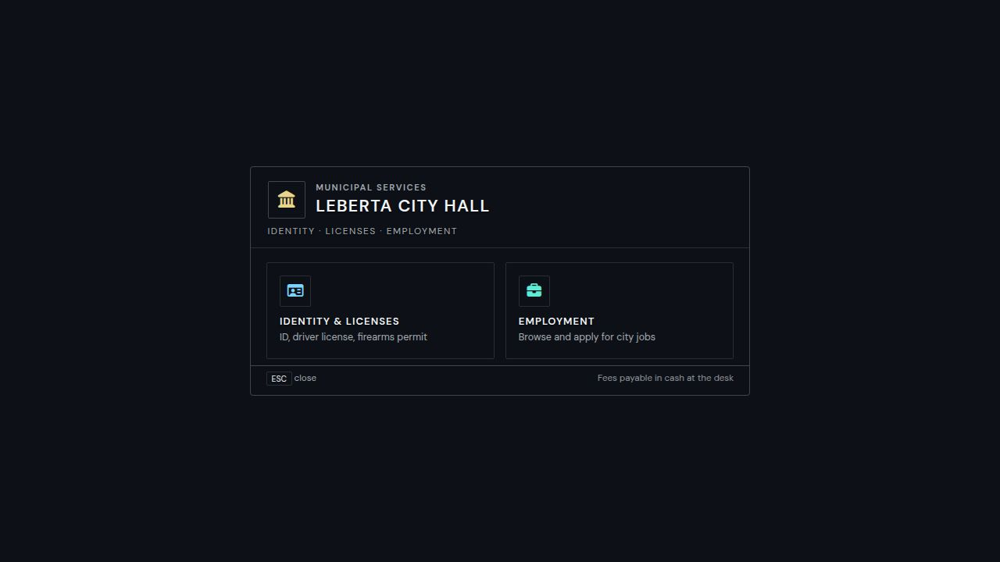

# Dach-cityhall
City Services for QB-Core Framework



## Dependencies
- [qb-core](https://github.com/qbcore-framework/qb-core)
- [PolyZone](https://github.com/mkafrin/PolyZone) - For Interaction (DrawText and qb-target both require this)
- [qb-target](https://github.com/BerkieBb/qb-target) 
- [ox_target](https://github.com/overextended/ox_target) 
- [jpr-phonesystem](https://github.com/qbcore-framework/jpr-phonesystem) - For E-Mail

## Features
- Redesigned NUI (civic / glass style) with lightweight **menu sounds** (Web Audio — no extra files)
- Ability to request ID Card when lost
- Ability to request driver license when granted by a driving instructor
- Ability to request weapon license when granted it by the police (`metadata.licences.weapon` — e.g. **ND_Police** `/weaponlicense` approval)
- Ability to apply to government jobs
- Ability to add multiple cityhall locations
- Ability to add nultiple driving school locations
- Ability to take driving lessons
- qb-target integration, this is optional
- PolyZone and qb-core DrawText integration, this is optional

## Installation
### Manual
- Download the script and put it in the `[qb]` directory.
- Add the following code to your server.cfg/resources.cfg
```
ensure qb-core
ensure qb-target # Optional
ensure jpr-phonesystem
ensure dach-cityhall
```

Created with ❤️ by Dakhchich
